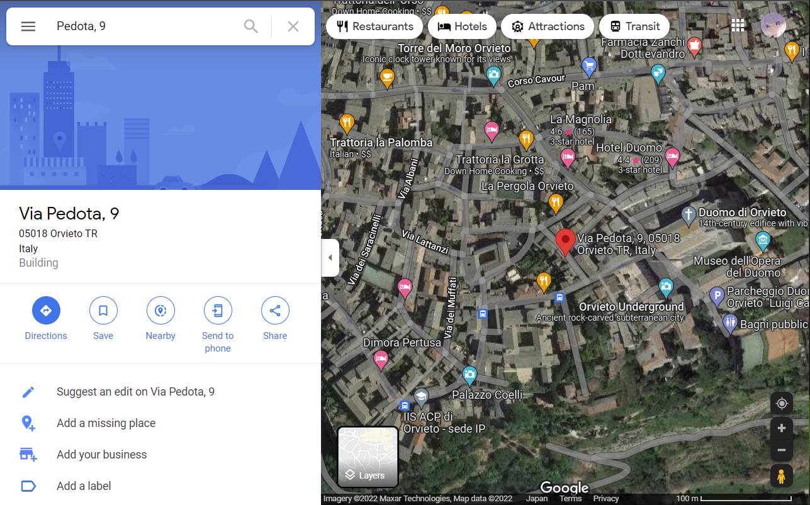
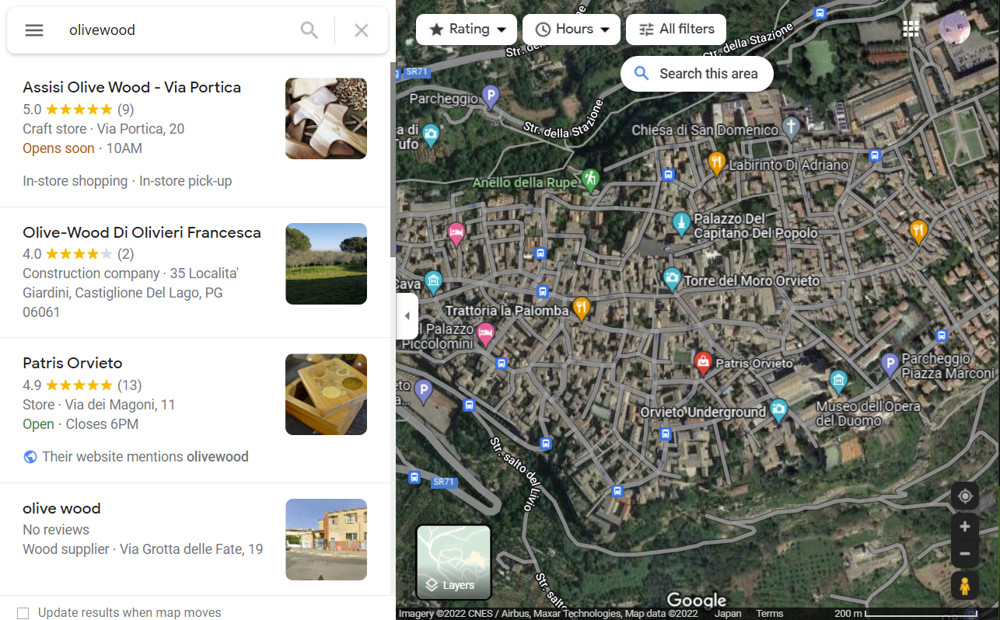
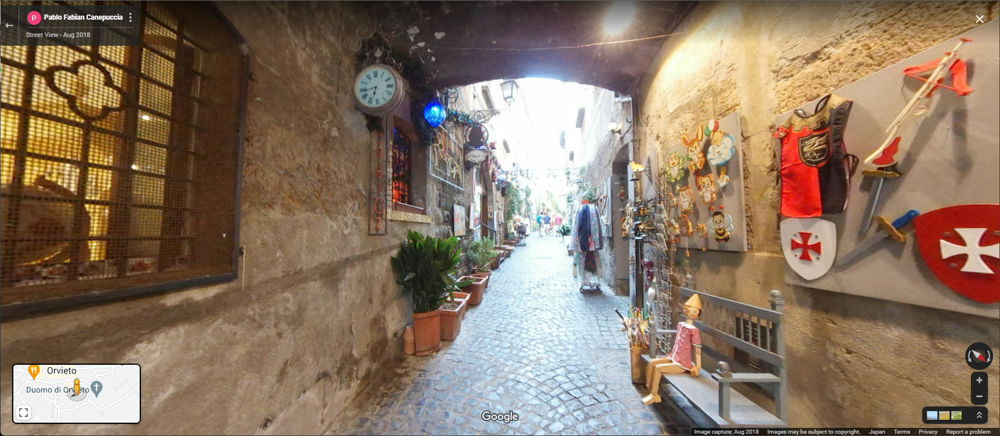

### 概要

画像の位置を特定し、緯度経度を入力せよ。

### 解法

画像にある Pedota, 9 という住所らしきものを検索することで、大まかな都市の場所は推定することができる。

この範囲内で "OLIVEWOOD" という店名らしき単語を検索すると、画像にある看板を発見できる。

ストリートビューを撮影した時と看板の位置は変わっているようなので、近くにあるアーチのような場所を探す。すると、先程の位置から南に少し下ったところに画像とよく似た場所を発見できる。

